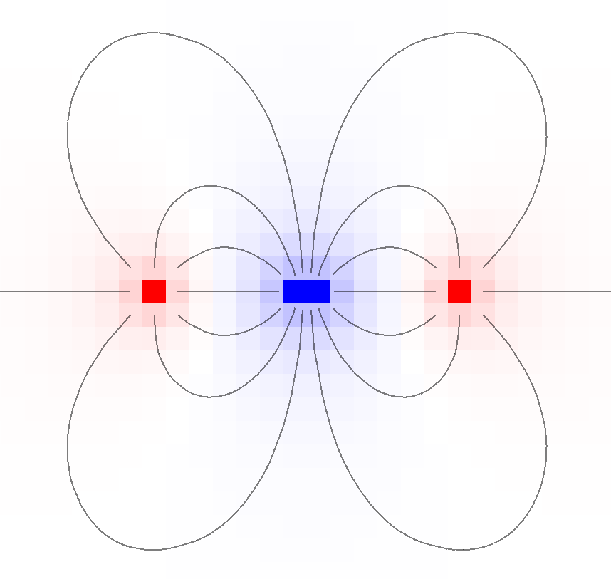
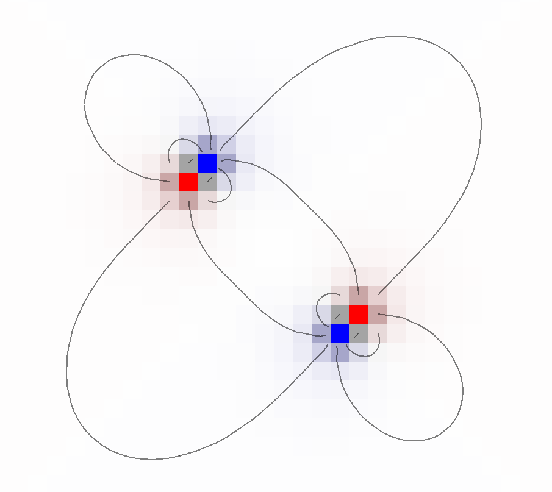
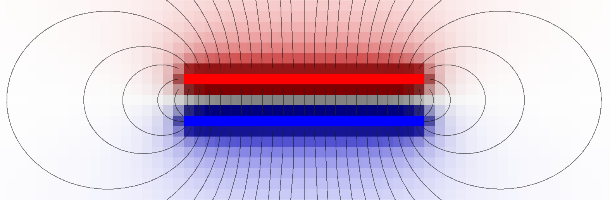

# estatic
Estatic is a static field visualizer written in the Rust language with the help of the piston, image, bitflags and nalgebra crates.

It's main aim is education, but it can produce accurate visualization thanks to settable resolutions.

## Features
* An easy to use graphic interface
* Colored field intesity and potential
* Field lines
* An editor to place and change charges

The compiled application is self contained in a single executable file

## Controls
* Move view: `Shift + Right Mouse + Drag`
* Center view: `Space`
* Place change: `Left Mouse`
* Erase charge: `Right Mouse`
* Switch change sign: `C`
* Toggle potential visualization: `P`
* Toggle field visualization: `F`
* Toggle field lines visualization: `L`

## Screenshots

