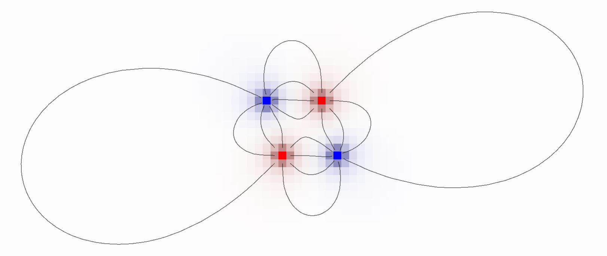

# estatic
Estatic is a static field visualizer written in the Rust language with the help of the piston, image, bitflags and nalgebra crates.

It's main aim is education, but it can produce accurate visualizations thanks to settable resolutions.

## Building
Estatic uses cargo, so compiling only consists in typing:

`cargo build`

If you want to directly run the application, you can also use:

`cargo run --release`

## Features
* An easy to use graphic interface
* An editor to place and change charges
* Colored field intensity and potential
* Field lines

The compiled application is self contained in a single executable file

## Controls
* Move view: `Shift + Right Mouse + Drag`
* Center view: `Space`
* Place change: `Left Mouse`
* Erase charge: `Right Mouse`
* Switch charge sign: `C`
* Toggle potential visualization: `P`
* Toggle field visualization: `F`
* Toggle field lines visualization: `L`

## Screenshots

